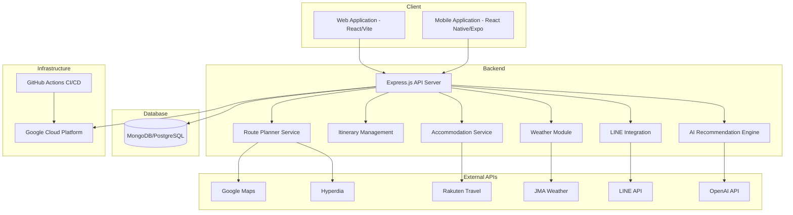

# 🇯🇵 Japan Travel Planner

**Japan Travel Planner** is an AI-powered full-stack web and mobile application designed to provide personalized travel itineraries for tourists visiting Japan. Leveraging advanced APIs for transportation, lodging, location services, and weather forecasts, this platform enables seamless travel planning and management across web and mobile devices.

---

## 🚀 Features

### 🌐 Web Application (Weeks 1–2)

- 🔎 **Location Search:** Integrated Google Maps API for detailed location information.
- 🚅 **Train Scheduling:** Real-time train schedules via Hyperdia API.
- 🏨 **Accommodation:** Comprehensive accommodation details through Rakuten Travel API.
- ☀️ **Weather Forecast:** Accurate weather updates using Japan Meteorological Agency API.
- 📆 **Daily Itinerary Management:** Create, edit, and delete your travel plans.
- 🛠 **Technology Stack:** React, Vite, Node.js, Express, MongoDB/PostgreSQL.

### 📱 Mobile Application (Weeks 3–4)

- 📲 **Cross-Platform Support:** Built with React Native and Expo.
- 🔄 **Synchronization:** Seamless data syncing with backend API.
- 🎨 **User Interface:** Traveler-focused UI designed with React Native Paper.
- 📶 **Offline Capabilities:** Planned offline functionality for travelers on-the-go.

### ✨ Advanced Enhancements (Weeks 5–6)

- 🤖 **AI-Powered Recommendations:** Intelligent travel itinerary generation using ChatGPT API.
- 💬 **Social Sharing:** Easily share travel itineraries with friends via LINE API.
- 🔐 **User Authentication:** Secure account creation, management, and persistent cloud storage.
- 📱 **Responsive UX/UI:** Optimized for a seamless mobile-first experience.

---

## 📅 Project Roadmap

| Milestone     | Timeline  | Deliverables                              |
| ------------- | --------- | ----------------------------------------- |
| Web MVP       | Weeks 1–2 | Web app, API integrations, CI/CD pipeline |
| Mobile MVP    | Weeks 3–4 | React Native app, backend synchronization |
| UX/UI Polish  | Week 5    | LINE integration, UI/UX refinement        |
| AI & Security | Week 6    | AI recommendations, user authentication   |
| Deployment    | Week 6    | Final testing, deployment, demo showcase  |

---

## 🧩 System Architecture



---

## 📂 Project Structure

```
japan-travel-planner/
├── client/        # Web frontend built with React + Vite
├── mobile/        # Mobile frontend built with React Native + Expo
├── server/        # Backend API developed with Node.js + Express
├── docs/          # Documentation, plans, diagrams, and notes
├── scripts/       # Utility and setup scripts
├── .github/       # CI/CD automation scripts via GitHub Actions
├── README.md      # Project overview and documentation
└── Work-Hours.md  # Development time logging
```

---

## 📚 Getting Started

### Prerequisites

- Node.js & npm/yarn installed
- MongoDB/PostgreSQL instance
- Expo CLI for mobile development

### Installation

Clone the repository and install dependencies:

```bash
git clone git@github.com:CodeByYuxuan/japan-travel-planner.git
cd japan-travel-planner
npm install
```

### Development

Start the development servers:

```bash
# Web client
cd client
npm run dev

# Mobile app
cd mobile
npm run start

# Backend API
cd server
npm run start
```

---

## 🤝 Contributing

Contributions are welcome! Please fork the repository, create a branch, and submit a pull request.
